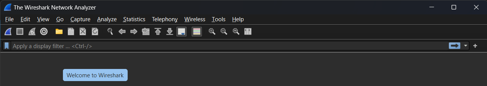

# Lab 1

## Вибір Unix-подібної операційної системи

Для виконання практичних було обрано WSL, так як основна операційна система на комп'ютері - Windows 11 і щоб не займати багато простору на диску підійманням віртуальної машини, було встановлено WSL та піднято операційну систему Ubuntu.

## Вибір компілятора

Для розробки був обраний пакет build-essentials, який містить усі необхідні інструменти для компіляції програм на C та C++:

## Документація

Були встановлені man-сторінки 2 та 3 розділів:

Також був завантажений стандарт мови програмування C останньої версії:

## Вибір середовища розробки

Для розробки була обрана IDE VsCode з встановленими допоміжними плагінами для розробки на C:

## Програми для налагодження

nslookup та dig:

Для захвату пакетів буде використовуватися tcpdump:

А для аналізу захоплених пакетів Wireshark, встановлений на хостовій системі:

